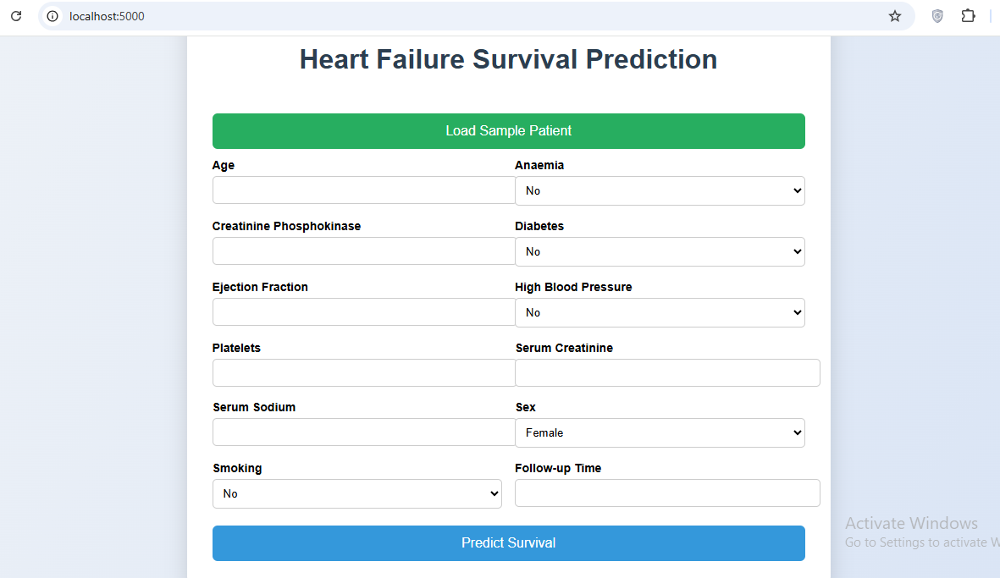
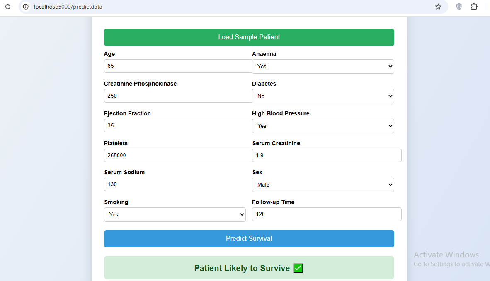

# ❤️ Heart Failure Survival Prediction — End-to-End ML Project

This project predicts the survival probability of patients with heart failure using clinical records.

The main objective is not only model accuracy, but to demonstrate a complete end-to-end Machine Learning system — from data ingestion and preprocessing to model deployment in the cloud using Docker.

This project follows a production-grade ML system design, not a notebook-based workflow.

## 🚀 Project Highlights

Modular ML pipeline using MVC architecture

Advanced preprocessing (Winsorization + RobustScaler + StandardScaler)

Multiple model comparison and hyperparameter tuning

Best model: HistGradientBoostingClassifier

Model & preprocessor serialized with dill

Flask web app for real-time predictions

Docker containerization

Cloud deployment on AWS / Azure

## 🧠 Machine Learning Pipeline

The project is structured into independent components:

###Data Ingestion

Reads raw dataset

Performs train/test split

Stores artifacts

### Data Transformation

Winsorization for outlier handling

ColumnTransformer with:

RobustScaler (skewed features)

StandardScaler (normal features)

Preprocessor saved as artifact

### Model Training

Multiple classifiers tested

Hyperparameter tuning using GridSearchCV

Best model selected based on F1 score

Model saved as artifact

### Prediction Pipeline

Loads saved model & preprocessor

Performs inference on new data

## 🌐 Web Application

A Flask web interface allows users to input patient clinical data and receive real-time survival prediction.

## 🐳 Run with Docker (Local)
docker build -t heart-failure-ml .
docker run -p 8000:8000 heart-failure-ml

Open in browser:

http://localhost:5000

## ☁️ Cloud Deployment

The Dockerized application can be deployed to:

AWS ECS + ECR

Azure Container Apps

This ensures portability, scalability, and production-ready deployment.

## 🛠 Tech Stack

Python

Pandas / NumPy

Scikit-learn

Flask

Docker

AWS / Azure

## 📁 Project Structure
├── artifacts/              # Saved model & preprocessor
├── src/
│   ├── components/         # Data ingestion, transformation, training
│   ├── pipeline/           # Prediction pipeline
│   ├── utils.py
│   └── exception.py
├── templates/              # HTML files
├── static/                 # CSS / assets
├── app.py                  # Flask app
├── Dockerfile
└── requirements.txt

## 📊 Dataset

Heart Failure Clinical Records Dataset containing medical attributes such as:

Age

Ejection Fraction

Serum Creatinine

Platelets

Diabetes

Smoking

Time of follow-up

And more…

Target variable: DEATH_EVENT

## 🎯 Goal of This Project

To demonstrate practical skills in:

ML pipeline engineering

Feature preprocessing strategies

Model lifecycle management

Docker containerization

Cloud deployment

Building ML systems beyond notebooks

## 📸 Screenshots

### Home Page

### Patient Data Form

### Prediction Result

## 👨‍💻 Author

Amr — AI Engineer in progress.