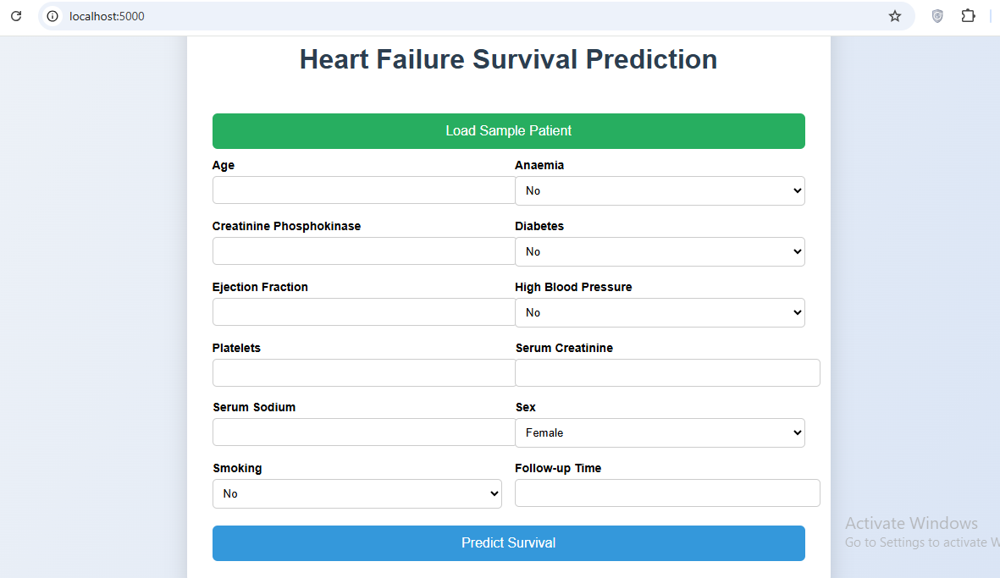
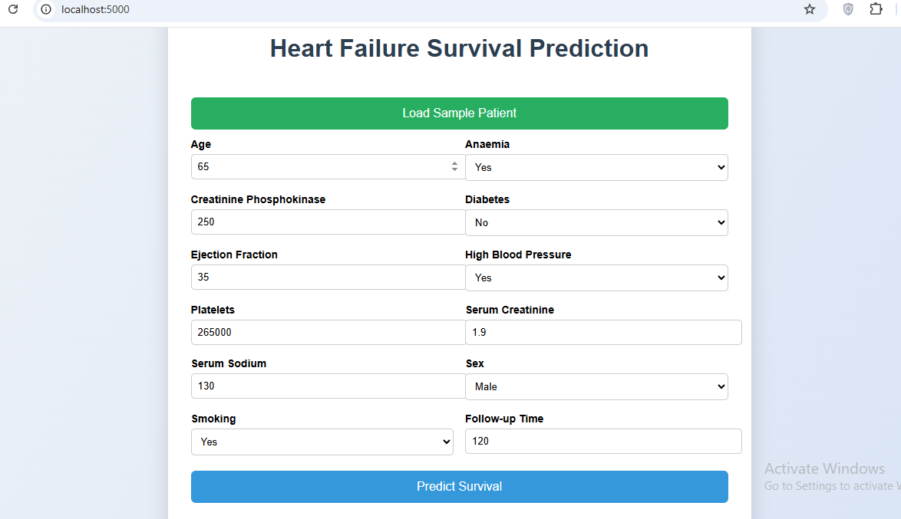
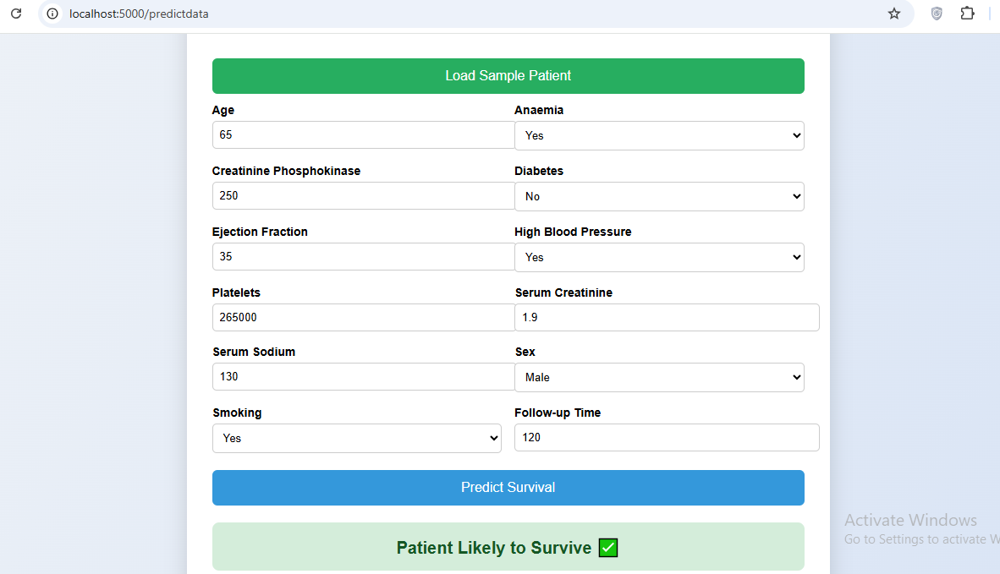

<div align="center">

# 🫀 Heart Failure Survival Prediction

### An End-to-End, Production-Grade Machine Learning System

[](https://python.org)
[](https://scikit-learn.org)
[](https://flask.palletsprojects.com)
[](https://docker.com)
[](https://azure.microsoft.com)
[](LICENSE)

> **Predicting heart failure survival outcomes from clinical records through a modular, containerized ML pipeline — engineered for reproducibility, scalability, and production deployment.**

</div>

---

## 📋 Table of Contents

- [Abstract](#-abstract)
- [System Architecture](#-system-architecture)
- [Production Pipeline](#-production-pipeline)
- [Tech Stack](#-tech-stack)
- [Project Structure](#-project-structure)
- [Dataset](#-dataset)
- [Performance Metrics](#-performance-metrics)
- [API Documentation](#-api-documentation)
- [Installation & Reproducibility](#-installation--reproducibility)
  - [Local Setup (venv)](#1-local-setup-venv)
  - [Docker (Recommended)](#2-docker-recommended)
  - [Cloud Deployment](#3-cloud-deployment-azure)
- [Screenshots](#-screenshots)
- [Contributing](#-contributing)
- [License](#-license)

---

## 🧬 Abstract

Heart failure is a leading cause of mortality worldwide, with clinical outcomes highly dependent on timely and accurate risk assessment. This project addresses that challenge by delivering a **fully automated, end-to-end Machine Learning system** that predicts patient survival probability from structured clinical records.

Unlike conventional notebook-based prototypes, this system is architected as a **modular, production-ready pipeline** — enforcing strict separation of concerns between data ingestion, feature transformation, model training, and inference. Every intermediate artifact is serialized to disk, enabling deterministic, fully reproducible predictions at inference time without re-computation.

The trained classifier, a `HistGradientBoostingClassifier` selected via exhaustive `GridSearchCV` hyperparameter optimization, is served through a containerized **Flask REST API**, deployable to **Azure Container Apps** with zero configuration changes.

**Key Value Proposition:** This project demonstrates not only sound ML methodology, but the engineering discipline required to take a model from experimentation to a scalable, maintainable, cloud-deployable service.

---

## 🏛️ System Architecture

The system follows a **Model-View-Controller (MVC)** design pattern adapted for ML systems, enforcing strict decoupling between pipeline stages. This is a deliberate architectural choice over monolithic notebook-based workflows for the following reasons:

| Concern | Notebook Workflow | This System (MVC) |
|---|---|---|
| **Reproducibility** | Stateful, order-dependent cells | Serialized artifacts guarantee identical outputs |
| **Testability** | Difficult to unit test | Each component is independently testable |
| **Scalability** | Single-process execution | Modular components can be parallelized or replaced |
| **Deployment** | Not deployable as-is | Containerized and cloud-ready |
| **Maintainability** | Logic scattered across cells | Encapsulated in dedicated modules |

The pipeline operates through three distinct layers:

- 🔵 **Data Layer** — Raw ingestion, train/test splitting, and artifact storage
- 🟡 **Logic Layer** — Feature engineering, transformation, and model training
- 🟢 **Service Layer** — Flask API serving serialized model and preprocessor artifacts

---

## ⚙️ Production Pipeline

The pipeline is composed of four independent, sequentially executed components. Each component reads its inputs from disk and writes its outputs as serialized artifacts, ensuring full statefulness and reproducibility.


```mermaid
flowchart LR
    A[🗄️ Raw Dataset\nCSV Input] --> B

    subgraph ingestion["① Data Ingestion"]
        B[Load Raw Data] --> C[Train / Test Split]
        C --> D[Persist Split Artifacts]
    end

    D --> E

    subgraph transformation["② Data Transformation"]
        E[Load Train Split] --> F{Feature Type?}
        F -->|Skewed| G[Winsorization\n+ RobustScaler]
        F -->|Normal| H[StandardScaler]
        G --> I[ColumnTransformer]
        H --> I
        I --> J[Serialize Preprocessor\npreprocessor.pkl]
    end

    J --> K

    subgraph training["③ Model Training"]
        K[Load Transformed Data] --> L[Multi-Model Comparison]
        L --> M[GridSearchCV\nHyperparameter Tuning]
        M --> N[Select Best Model\nF1 Score Criterion]
        N --> O[Serialize Model\nmodel.pkl]
    end

    O --> P

    subgraph inference["④ Prediction Pipeline"]
        P[Load model.pkl\n+ preprocessor.pkl] --> Q[Transform Input]
        Q --> R[Run Inference]
        R --> S[🫀 Survival\nPrediction]
    end

    style ingestion fill:#1e3a5f,stroke:#4a90d9,color:#fff
    style transformation fill:#1a3d2e,stroke:#4aad7a,color:#fff
    style training fill:#3d2a1a,stroke:#d98c4a,color:#fff
    style inference fill:#2d1a3d,stroke:#9c4ad9,color:#fff
```

### Component Details

**① Data Ingestion**
> Reads the raw clinical records dataset, performs a stratified train/test split, and persists the resulting subsets to the `artifacts/` directory. This ensures downstream components always operate on a consistent, version-controlled data split.

**② Data Transformation**
> Applies a dual-scaler strategy within a `ColumnTransformer`: `RobustScaler` is applied to features with high skewness (resilient to outliers), while `StandardScaler` normalizes near-normally distributed features. Outlier clipping via **Winsorization** is applied upstream. The fitted `ColumnTransformer` is serialized as `preprocessor.pkl` — a critical artifact ensuring training-serving skew is eliminated at inference time.

**③ Model Training**
> Multiple classifiers are evaluated in a systematic comparison. `GridSearchCV` with cross-validation drives hyperparameter optimization. The winning model — `HistGradientBoostingClassifier` — is selected based on F1 Score, appropriate for the clinical imbalance context. The fitted estimator is serialized as `model.pkl`.

**④ Prediction Pipeline**
> The inference path exclusively loads `model.pkl` and `preprocessor.pkl`. Raw feature input is transformed through the identical preprocessing graph used during training before being passed to the estimator — guaranteeing consistent, reproducible predictions.

---

## 🛠️ Tech Stack

| Category | Technology | Role |
|---|---|---|
| **Language** | Python 3.10+ | Core implementation language |
| **Data Processing** | Pandas, NumPy | Data manipulation and numerical computation |
| **ML Framework** | Scikit-learn | Preprocessing, modeling, and evaluation |
| **Serialization** | Pickle | Artifact persistence for model and preprocessor |
| **Web Framework** | Flask | REST API and web interface server |
| **Containerization** | Docker | Scalable, portable application packaging |
| **Cloud Platform** | Azure Container Apps / ACR | Production-grade container orchestration |
| **Frontend** | HTML5, CSS3, Jinja2 | Web UI templating |

---

## 📁 Project Structure

```
heart-failure-prediction/
│
├── artifacts/                      # Serialized pipeline artifacts (auto-generated)
│   ├── model.pkl                   # Trained HistGradientBoostingClassifier
│   ├── preprocessor.pkl            # Fitted ColumnTransformer
│   ├── train.csv                   # Training split
│   ├── test.csv                    # Test split
│   └── data.csv                    # Raw dataset copy
│
├── src/
│   ├── components/                 # Core pipeline components
│   │   ├── data_ingestion.py       # Raw data loading & splitting
│   │   ├── data_transformation.py  # Feature engineering & scaling
│   │   └── model_trainer.py        # Model comparison, tuning & selection
│   │
│   ├── pipeline/
│   │   └── predict_pipeline.py       # Inference pipeline (loads artifacts)
│   │
│   ├── utils.py                    # Shared utility functions
│   ├── exception.py                # Centralized exception handling
│   └── logger.py                   # Structured logging configuration
│
├── templates/                      # Jinja2 HTML templates
│   └── index.html                  # Application entry page
│
├── static/                         # Static assets (CSS, JS, images)
├── assets/                         # Documentation screenshots
│
├── app.py                          # Flask application entry point
├── Dockerfile                      # Container build specification
├── .dockerignore                   # Docker build context exclusions
├── setup.py                        # Package installation configuration
├── requirements.txt                # Pinned Python dependencies
└── README.md
```

---

## 📊 Dataset

**Source:** [Heart Failure Clinical Records Dataset](https://archive.ics.uci.edu/ml/datasets/Heart+failure+clinical+records) — UCI ML Repository

The dataset comprises **299 patient records** with **12 clinical features** collected during follow-up periods at a medical center.

| Feature | Type | Description |
|---|---|---|
| `age` | Continuous | Patient age in years |
| `ejection_fraction` | Continuous | Percentage of blood leaving the heart per contraction |
| `serum_creatinine` | Continuous | Level of creatinine in blood (mg/dL) |
| `serum_sodium` | Continuous | Level of sodium in blood (mEq/L) |
| `platelets` | Continuous | Platelet count in blood (kiloplatelets/mL) |
| `creatinine_phosphokinase` | Continuous | Level of CPK enzyme in blood (mcg/L) |
| `diabetes` | Binary | Whether the patient has diabetes |
| `anaemia` | Binary | Decrease of red blood cells |
| `high_blood_pressure` | Binary | Hypertension flag |
| `sex` | Binary | Patient biological sex |
| `smoking` | Binary | Whether the patient smokes |
| `time` | Continuous | Follow-up period duration (days) |
| **`DEATH_EVENT`** | **Binary** | **Target: 1 = deceased, 0 = survived** |

---

## 📈 Performance Metrics

The following table reflects model evaluation on the held-out test set. Metrics are computed post-hyperparameter optimization via `GridSearchCV`.

| Model | Accuracy | F1 Score | Precision | Recall | AUC-ROC |
|---|---|---|---|---|---|
| HistGradientBoostingClassifier ⭐ | `_.__` | `_.__` | `_.__` | `_.__` | `_.__` |
| RandomForestClassifier | `_.__` | `_.__` | `_.__` | `_.__` | `_.__` |
| LogisticRegression | `_.__` | `_.__` | `_.__` | `_.__` | `_.__` |
| KNN | `_.__` | `_.__` | `_.__` | `_.__` | `_.__` |
| XGBClassifier | `_.__` | `_.__` | `_.__` | `_.__` | `_.__` |

> ⭐ **Best Model:** `HistGradientBoostingClassifier` — selected based on F1 Score, which best accounts for class imbalance in this clinical context.

---

## 📡 API Documentation

The Flask application exposes the following endpoints:

---

### `GET /`

**Description:** Renders the application landing page.

**Response:** `200 OK` — HTML

---

### `GET /predict`

**Description:** Renders the patient data input form.

**Response:** `200 OK` — HTML (form view)

---

### `POST /predict`

**Description:** Accepts patient clinical data, runs the prediction pipeline, and returns a survival prediction.

**Content-Type:** `application/x-www-form-urlencoded` (form submission) or `application/json`

**Request Body:**

```json
{
  "age": 65,
  "ejection_fraction": 38,
  "serum_creatinine": 1.4,
  "serum_sodium": 136,
  "platelets": 263358.03,
  "creatinine_phosphokinase": 582,
  "diabetes": 0,
  "anaemia": 1,
  "high_blood_pressure": 0,
  "sex": 1,
  "smoking": 0,
  "time": 90
}
```

**Response — Success (`200 OK`):**

```json
{
  "status": "success",
  "prediction": 1,
  "prediction_label": "High Risk — Survival Unlikely",
  "survival_probability": 0.23
}
```

**Response — Error (`422 Unprocessable Entity`):**

```json
{
  "status": "error",
  "message": "Missing required field: ejection_fraction"
}
```

---

## 🚀 Installation & Reproducibility

### Prerequisites

- Python `3.10+`
- Docker `24.0+` (for containerized deployment)
- Azure CLI `2.x` (for cloud deployment)

---

### 1. Local Setup (venv)

```bash
# Clone the repository
git clone https://github.com/AmrAldaly/end-to-end-heart-failure-ml-system
cd end-to-end-heart-failure-ml-system

# Create and activate a virtual environment
python -m venv venv
source venv/bin/activate        # macOS / Linux
# venv\Scripts\activate         # Windows

# Install pinned dependencies
pip install -r requirements.txt

# Run the training pipeline (generates artifacts/)
python src/components/data_ingestion.py

# Start the Flask development server
python app.py
```

Open in browser: [http://localhost:5000](http://localhost:5000)

---

### 2. Docker (Recommended)

Scalable containerization via Docker ensures environment parity across development, staging, and production.

```bash
# Build the Docker image
docker build -t heart-failure-ml:latest .

# Run the container with port binding
docker run -p 8000:8000 heart-failure-ml:latest
```

Open in browser: [http://localhost:8000](http://localhost:8000)

**Build Arguments (optional):**

```bash
# Pass environment variables at build time
docker build \
  --build-arg FLASK_ENV=production \
  -t heart-failure-ml:latest .
```

---

### 3. Cloud Deployment (Azure)

The containerized application is deployable to **Azure Container Apps** via **Azure Container Registry (ACR)** with zero code modifications.

```bash
# Log in to Azure
az login

# Create a resource group
az group create --name heart-failure-rg --location eastus

# Create an Azure Container Registry
az acr create --resource-group heart-failure-rg \
  --name heartfailureacr --sku Basic

# Log in to ACR
az acr login --name heartfailureacr

# Tag and push the image
docker tag heart-failure-ml:latest heartfailureacr.azurecr.io/heart-failure-ml:latest
docker push heartfailureacr.azurecr.io/heart-failure-ml:latest

# Deploy to Azure Container Apps
az containerapp up \
  --name heart-failure-app \
  --resource-group heart-failure-rg \
  --image heartfailureacr.azurecr.io/heart-failure-ml:latest \
  --target-port 8000 \
  --ingress external
```

---

## 🖼️ Screenshots

### 🏠 Landing Page


### 📝 Patient Data Input Form


### 🔮 Prediction Result


---

## 🤝 Contributing

Contributions, issues, and feature requests are welcome.

1. **Fork** the repository
2. **Create** your feature branch: `git checkout -b feature/your-feature-name`
3. **Commit** your changes: `git commit -m 'feat: add meaningful description'`
4. **Push** to the branch: `git push origin feature/your-feature-name`
5. **Open** a Pull Request

Please ensure all contributions include appropriate unit tests and adhere to PEP 8 style guidelines.

---

## 📄 License

This project is licensed under the **MIT License** — see the [LICENSE](LICENSE) file for details.

---

<div align="center">

**Built with precision by [Amr](https://github.com/AmrAldaly) · AI & ML Engineering**

*If this project was useful to you, consider giving it a ⭐*

</div>
